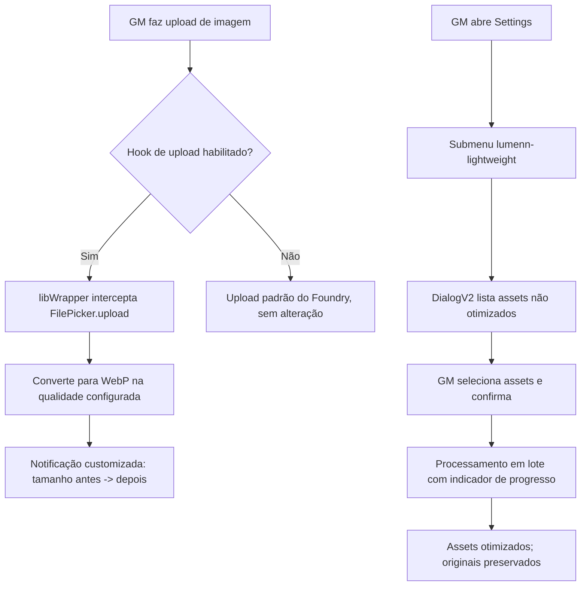

# PDR: lumenn-lightweight (Product Design Record)

## Clarifications
> [!question] Ambiguidades de design resolvidas no Clarify
- [x] A notificação do hook de upload usa o padrão do Foundry ou algo customizado? → Customizada, com a identidade visual do mascote (raposa-espírito).
- [x] Como o Dialog de modo lote é acessado? → Submenu dedicado via `game.settings.registerMenu`, não um botão solto na tela.

## 1. Contexto e Motivação

### 1.1. Problema
Conforme [[Requirements-lumenn-lightweight]], o problema é peso de imagem acumulado em mundos Foundry, sem uma solução que cubra prevenção (upload) e correção (lote) ao mesmo tempo, de forma simples e com identidade própria.

### 1.2. Oportunidade
Diferenciar de concorrentes (Geano's, Media Optimizer) não só tecnicamente, mas na experiência: o módulo tem uma mascote (raposa-espírito) que humaniza feedback normalmente frio ("arquivo comprimido") em algo com personalidade — reforçando a marca Lumenn.

## 2. Objetivos do Produto/Design
- **Objetivo 1**: O GM entende, em menos de 2 segundos, que uma imagem foi otimizada e quanto espaço foi economizado, sem precisar abrir nenhum painel.
- **Objetivo 2**: O modo lote é descoberto naturalmente dentro do fluxo padrão do Foundry (Settings), sem exigir documentação externa para ser encontrado.
- **Objetivo 3**: A identidade visual (mascote) aparece nos pontos de maior contato (notificação, ícone do submenu) sem poluir a UI do Foundry.

## 3. User Stories (Perspectiva de Design)

### US-D001: Feedback visual de otimização automática
**Descrição**: Como Game Master, eu quero ver uma notificação com a cara do módulo quando uma imagem é otimizada no upload, para que eu confie que o processo funcionou sem precisar verificar manualmente.

**Critérios de Aceitação (Design)**:
- [ ] A notificação usa um componente customizado (não `ui.notifications` genérico), posicionado de forma a não bloquear o fluxo de trabalho do GM.
- [ ] Mostra claramente: tamanho antes → tamanho depois (ex.: "2.3MB → 340KB").
- [ ] Inclui um elemento visual pequeno do mascote (ícone/silhueta), sem ocupar espaço desproporcional.
- [ ] Desaparece automaticamente após poucos segundos (não exige clique para fechar).

### US-D002: Descoberta do modo lote
**Descrição**: Como Game Master, eu quero encontrar a opção de otimização em lote no lugar onde já procuro outras configurações de módulo, para não precisar de tutorial externo.

**Critérios de Aceitação (Design)**:
- [ ] O modo lote aparece como um submenu dedicado dentro de Module Settings (`game.settings.registerMenu`), com nome e ícone claros.
- [ ] Abrir o submenu lança um `DialogV2` (`foundry.applications.api.DialogV2`), consistente com os padrões visuais nativos do Foundry v13+.
- [ ] Dentro do Dialog, os assets não otimizados são listados de forma escaneável (nome + tipo + tamanho atual), com seleção múltipla.
- [ ] Um indicador de progresso é visível durante o processamento em lote (RF-008 dos Requirements).

## 4. Decisões de Design

> [!note] Decisão de Design: Notificação Customizada vs. Nativa do Foundry
> **Contexto**: O hook de upload precisa comunicar economia de espaço sem interromper o fluxo do GM.
> **Alternativas Consideradas**:
> - (a) `ui.notifications.info()` nativo — zero esforço de implementação, mas visualmente idêntico a qualquer outro módulo, sem identidade.
> - (b) Elemento customizado (pequeno card/toast próprio) com o mascote — mais esforço de implementação (CSS próprio, template), mas reforça marca e torna o feedback mais amigável.
> **Decisão**: (b) Notificação customizada, confirmada explicitamente pelo usuário no Clarify.
> **Implicações**: Exige um pequeno componente de UI próprio (HTML/CSS template do módulo) em vez de apenas chamar a API nativa — a ser detalhado no Blueprint como um componente isolado, sem acoplar à lógica de compressão (Constitution Artigo III — responsabilidade única por arquivo).

> [!note] Decisão de Design: Submenu Dedicado vs. Botão Simples para Modo Lote
> **Contexto**: O modo lote precisa de um ponto de entrada dentro de Settings.
> **Alternativas Consideradas**:
> - (a) Botão simples (`game.settings.register` com `type: Button` ou settings hint com link) — mais rápido de implementar, mas menos descobrível/organizado.
> - (b) Submenu dedicado (`game.settings.registerMenu` + `FormApplication`/`DialogV2`) — já documentado no Research, é o padrão usado por módulos de configuração mais complexa no Foundry.
> **Decisão**: (b) Submenu dedicado, confirmado pelo usuário no Clarify.
> **Implicações**: Requer registrar uma classe de menu (`registerMenu`) além do `DialogV2` em si — uma camada extra de código, mas alinhada ao padrão nativo esperado pelos usuários de módulos Foundry.

## 5. Experiência do Usuário (UX)

### 5.1. User Personas
- **GM Solo/Indie** (perfil primário, alinhado ao próprio Lumen): administra seu próprio mundo Foundry, sem equipe técnica, quer que "simplesmente funcione" sem exigir passos manuais recorrentes.
- **GM com Comunidade/Grupo Fixo**: mundo mais populoso, biblioteca de assets maior (múltiplos jogadores subindo fichas/tokens), maior necessidade do modo lote para limpeza periódica.

### 5.2. Jornada do Usuário
1. GM instala o módulo → dependência `libWrapper` é checada (RF-012: se ausente, hook desabilitado, lote continua funcional).
2. GM sobe uma imagem de Ator → hook intercepta → notificação customizada aparece com antes/depois.
3. Periodicamente, GM abre Settings → vê o submenu do módulo → abre `DialogV2` → seleciona assets antigos não otimizados → dispara lote → acompanha progresso.

### 5.3. Fluxos de Interação

## 6. Requisitos de Interface (UI)
- **Componentes Necessários**:
  - [ ] Componente de notificação customizada (template HTML/CSS próprio do módulo, com elemento visual do mascote)
  - [ ] Classe de submenu (`game.settings.registerMenu`) com ícone do módulo
  - [ ] `DialogV2` de seleção em lote (lista + checkboxes + botão de confirmação)
  - [ ] Indicador de progresso (barra ou contador "X de Y processados") dentro do `DialogV2` ou como elemento auxiliar
- **Links para Mockups/Protótipos**: nenhum ainda — mascote conceitual descrito em conversa anterior (raposa-espírito, estética Redice Studio/Solo Leveling); ilustração final não gerada nesta sessão.

## 7. Não-Objetivos (Out of Scope)
- Não será abordado: painel de estatísticas históricas de economia de espaço (é uma ideia futura possível, não v1).
- Não será abordado: personalização do mascote/tema visual pelo usuário final.
- Não será abordado: onboarding/wizard de primeira execução — a descoberta via Settings padrão é considerada suficiente para o v1.

## 8. Critérios de Sucesso
- **Métrica 1**: GM consegue localizar e acionar o modo lote em Settings sem consultar documentação externa (validação qualitativa, não instrumentada em telemetria — o módulo não coleta dados de uso).
- **Métrica 2**: Redução de pelo menos 40% no tamanho de imagens otimizadas, conforme RNF-001 dos Requirements, perceptível na própria notificação de antes/depois.

---
**Conformidade**: este documento adere à [[Constitution-lumenn-lightweight]].

**Documentos Relacionados**:
- [[Constitution-lumenn-lightweight]]
- [[Requirements-lumenn-lightweight]]
- [[Research-lumenn-lightweight]]
- [[Blueprint-lumenn-lightweight]]
- [[Specs-lumenn-lightweight]]
